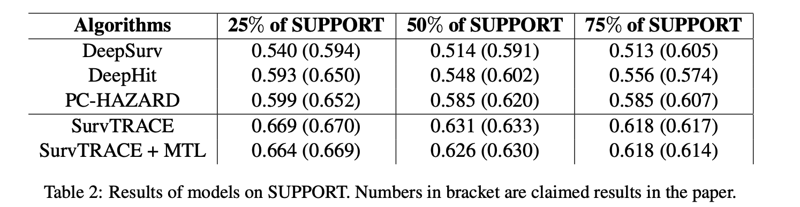
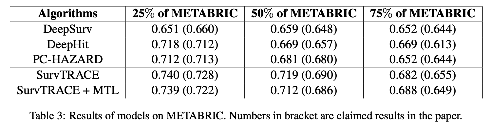

# SurvTRACE: Transformers for Survival Analysis with Competing Events

## Citation of the paper:

```latex
@article{wang2021survtrace,
      title={Surv{TRACE}: Transformers for Survival Analysis with Competing Events}, 
      author={Zifeng Wang and Jimeng Sun},
      year={2021},
      eprint={2110.00855},
      archivePrefix={arXiv},
      primaryClass={cs.LG}
}
```

## Link to the original's repo:

https://github.com/RyanWangZf/SurvTRACE

## Dependency

```
easydict==1.9
scikit_survival==0.14.0
pandas==1.1.5
torchtuples==0.2.2
numpy==1.19.5
torch==1.9.1
matplotlib==3.3.4
pycox==0.2.2
scikit_learn
```

## SUPPORT and METABRIC Download

Import **metabric** and **support** from **pycox.datasets** could directly generates the dataframe of dataset. Detail can be seen in both the notebooks and the run.py file.

## Preprocessing/Training/Evaluation code

For baseline models, please refer to the jupyter notebooks.
For SurvTRACE, please refer to dataset.py/train_utils.py/evaluate_utils.py

## Table of Results

1. The results on SUPPORT, with claimed results in bracket

  

2. The results on METABRIC, with claimed results in bracket

  